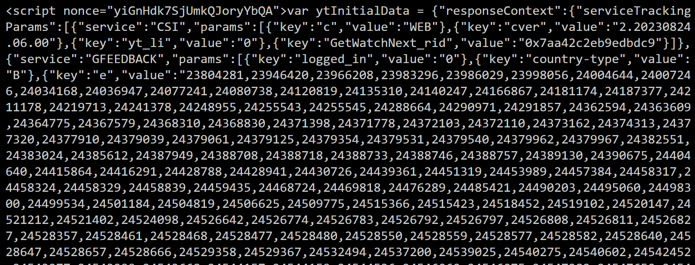
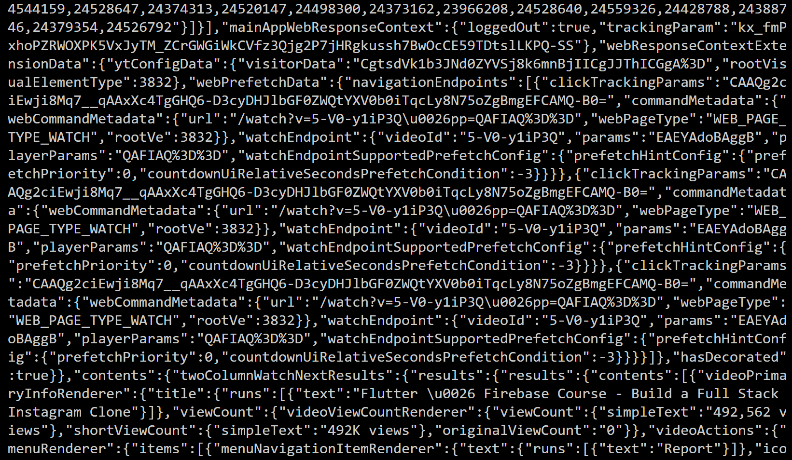

# YouTube Likes and Views Count

Created this project to fetch details of a youtube video provided it's link, cause the youtube api was down at that time, and it limits to the number of requests made.

In this code we are first finding the very first 'script' tag, as every script tag includes a [nonce](https://www.techtarget.com/searchsecurity/definition/nonce) value. Nonce is a standard practice to avoid too many get requests and thus web scrapping.
 
We are looking for a script tag that looks something like this: 

.
.
.

This is usually in the 43rd or 45th index of the script_data_list. If Total Likes and Total Views, is null, play around with the index number and find the script tag that looks like the above screenshot